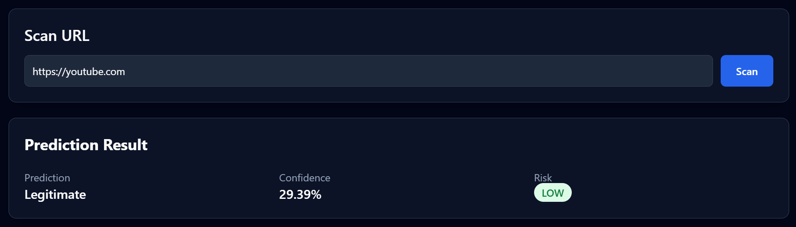
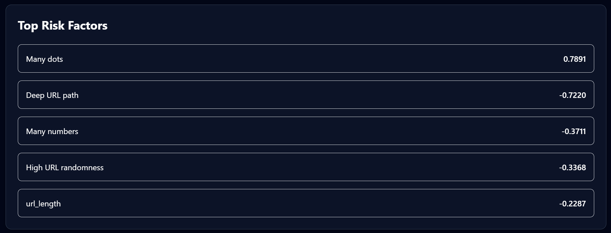
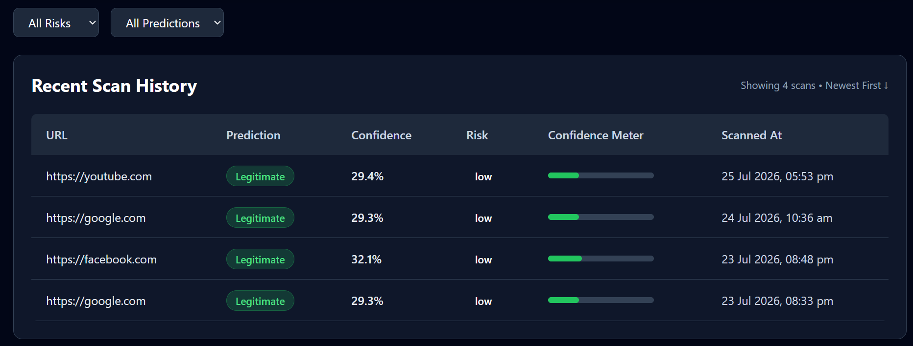

# 🛡️ PhishHook 

> An end-to-end phishing URL detection platform powered by Machine Learning, Explainable AI, and modern cloud technologies.


<h2 align="center">Dashboard</h2>

<p align="center">
  
</p>

---

# 🚀 Live Demo

- 🌐 **Live Demo:** https://phishhook.vercel.app
- 📚 **API Docs:** https://phishhook-backend.onrender.com/docs
  
# 📖 Overview

PhishHook is a full-stack phishing URL detection platform that combines Machine Learning, Explainable AI, and cloud deployment into a single application.
Users can submit URLs through a React dashboard and receive:

- Phishing prediction
- Confidence score
- Risk level
- SHAP-based feature explanations

Every scan is stored in PostgreSQL, allowing users to review previous predictions through a searchable history dashboard.

PhishHook demonstrates how a machine learning model can be integrated into a full-stack application, exposing predictions through REST APIs, providing model explainability with SHAP, and persisting scan history in a cloud-hosted PostgreSQL database.

# ✨ Features

### Machine Learning

  - XGBoost-based phishing detection model
  - Probability-based predictions
  - Configurable classification threshold
  - Risk categorization (Low / Medium / High)

## Explainable AI

  - SHAP feature importance
  - Human-readable explanations
  - Prediction transparency

## Backend

  - FastAPI REST APIs
  - PostgreSQL integration
  - SQLAlchemy ORM
  - History filtering
  - Pagination
  - Health endpoint
  - Redis cache support with fallback

## Frontend

  - React + Vite
  - Responsive dashboard
  - URL scanner
  - Prediction cards
  - SHAP explanation panel
  - Scan history
  - Risk filters

## Infrastructure

  - Dockerized application
  - GitHub source control
  - Render deployment
  - Vercel deployment
  - Neon PostgreSQL

# 📸 Application Screenshots


<h2 align="center">Prediction Result</h2>

<p align="center">
  
</p>

<h2 align="center">SHAP Explainability</h2>

<p align="center">
  
</p>

<h2 align="center">History</h2>

<p align="center">
  
</p>

# 🏗️ System Architecture

```text
                    React + Vite (Vercel)
                              │
                              ▼
                   FastAPI REST Backend
                         (Render)
                              │
         ┌────────────────────┼────────────────────┐
         ▼                    ▼                    ▼
  XGBoost Model         SHAP Explainer      PostgreSQL
                                                (Neon)
```


# 🧠 Machine Learning Pipeline

```text
URL Input
      │
      ▼
Feature Extraction
      │
      ▼
13 Engineered URL Features
      │
      ▼
XGBoost Model
      │
      ▼
Prediction Probability
      │
      ▼
Risk Classification
      │
      ▼
SHAP Explainability
      │
      ▼
Store Result in PostgreSQL
```

# 📊 Engineered Features

The model extracts multiple handcrafted features from each URL, including:

- URL Length
- Domain Length
- Number of Dots
- HTTPS Usage
- Presence of IP Address
- Suspicious Keywords
- Digit Count
- Letter Count
- URL Entropy
- Path Depth
- Special Character Count
- Suspicious Top-Level Domains
- Subdomain Count


# 💡 Explainable AI

  Instead of providing only a prediction, PhishHook explains **why** the model reached its decision.
  
  The application uses **SHAP (SHapley Additive Explanations)** to identify the features that contributed most to each prediction.
  
  This improves transparency and helps users understand the reasoning behind the classification.


# 🛠️ Tech Stack

## Frontend

  - React
  - Vite
  - Axios
  - Tailwind CSS

## Backend

  - FastAPI
  - Python
  - SQLAlchemy
  - Uvicorn

## Machine Learning

  - XGBoost
  - Pandas
  - NumPy
  - Scikit-learn
  - SHAP
  - Joblib

## Database

  - PostgreSQL
  - Neon

## DevOps

  - Docker
  - Docker Compose
  - GitHub
  - Render
  - Vercel


# 📂 Project Structure

```text
PhishHook
│
├── frontend
│   ├── src
│   ├── components
│   ├── pages
│   └── services
│
├── src
│   ├── config
│   ├── data
│   ├── database
│   ├── models
│   ├── services
│   ├── utils
│   └── main.py
│
├── Dockerfile
├── docker-compose.yml
├── requirements.txt
└── README.md

```

# 📡 API Endpoints

1. POST  - `/scan-url` 
2. GET - `history` 
3. GET - `/health` 


# ⚙️ Running Locally

## Clone Repository

  ```bash
  git clone https://github.com/YOUR_USERNAME/phishhook.git
  cd phishhook
  ```

## Backend

  ```bash
  python -m venv venv
  
  venv\Scripts\activate
  
  pip install -r requirements.txt
  
  python create_tables.py
  
  uvicorn src.main:app --reload
  ```

## Frontend

  ```bash
  cd frontend
  
  npm install
  
  npm run dev
  ```

# 🐳 Docker

  ```bash
  docker compose up --build
  ```


# ☁️ Deployment

1. Frontend - Vercel
2. Backend - Render 
3. Database - Neon


# 🔮 Future Improvements

- User authentication
- Batch URL scanning
- CSV upload support
- Domain reputation APIs
- Dark mode
- Real-time analytics dashboard
- CI/CD pipeline
- Automated model retraining
- Kubernetes deployment


# 👨‍💻 Author

**Akash Raghav**

**LinkedIn:** https://www.linkedin.com/in/akash-raghav/


# ⭐ Support

If you found this project interesting, consider giving it a ⭐ on GitHub.
